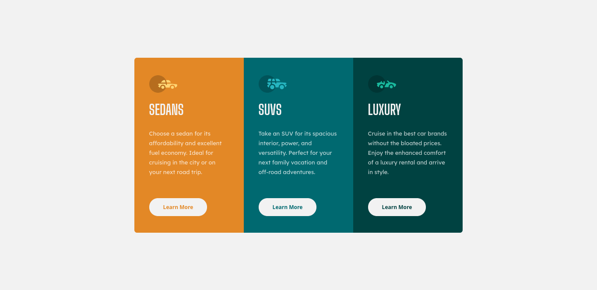
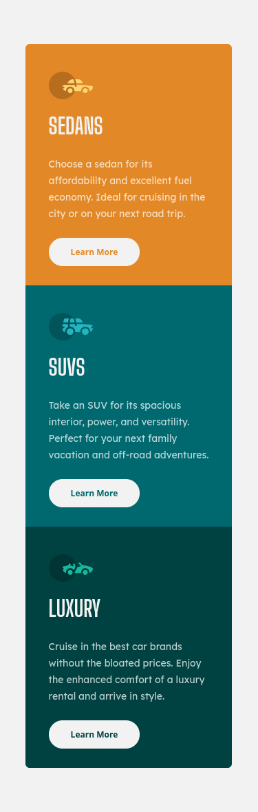

# Frontend Mentor - 3-column preview card component solution

This is a solution to the [3-column preview card component challenge on Frontend Mentor](https://www.frontendmentor.io/solutions/3-column-card-preview-54BYzmfGZ).

## Table of contents

- [Overview](#overview)
  - [The challenge](#the-challenge)
  - [Screenshot](#screenshot)
  - [Links](#links)
- [My process](#my-process)
  - [Built with](#built-with)
  - [What I learned](#what-i-learned)
  - [Continued development](#continued-development)
  - [Useful resources](#useful-resources)
- [Author](#author)
- [Acknowledgments](#acknowledgments)

## Overview

### The challenge

Users should be able to:

- View the optimal layout depending on their device's screen size
- See hover states for interactive elements

### Screenshot

*Desktop Design Preview*


*Mobile Design Preview*


### Links

- Solution URL: [My Solution](https://www.frontendmentor.io/solutions/3-column-card-preview-54BYzmfGZ)
- Live Site URL: [Live preview site](https://ivan-moniz.github.io/column_card/)

## My process

### Built with

- Semantic HTML5 markup
- BEM Block Element Modifier
- CSS custom properties
- Flexbox
- CSS Grid
- Responsive Web Design workflow

### What I learned

I learned how to name my classes elements better in a way I can remember and style them easily. 
I also grasped how to center the elements design with *CSS* by using *flex* and the *min-height* property.

To see how you can see, the code snippet below:

```html
<body>
  <h1 class="center__element"> Center Element</h1>   
</body>
```
```css
body {
  display: flex;
  justify-content: center;
  align-items: center;
  min-height: 100vh;
}
```

### Continued development

Flexbox & CSS Grid property with Mobile first Design should be my top priority in my dream 
to become a **Front-end Developer**, which day by day its becoming more and more exiciting as 
I dive deep into this carreer and subject around it. Also the *self-learning* experience is the
best that could ever happened to me. So I am proud of this. 

### Useful resources

- [MDN Web Docs](https://developer.mozilla.org/en-US/) - The mozilla developer student guide 
helped understand vary quick how to use and why to use flex and grid property to place my elements 
correctly in my **HTML** file and use the property intelligently on **CSS**.

## Author

- Website Challenge Projects - [Ivan Moniz](https://ivan-moniz.github.io/front-end-mentor-challenges)
- Frontend Mentor - [ivan-moniz](https://www.frontendmentor.io/profile/ivan-moniz)
- Git Hub - [ivan-moniz](https://github.com/ivan-moniz)


## Acknowledgments

This challenge was developed by me alone *Ivan Moniz* which got thinking and focusing my attention
in what should be my top priorities from now on and execute that priority every single day in my 
life until I get a job in that area.

